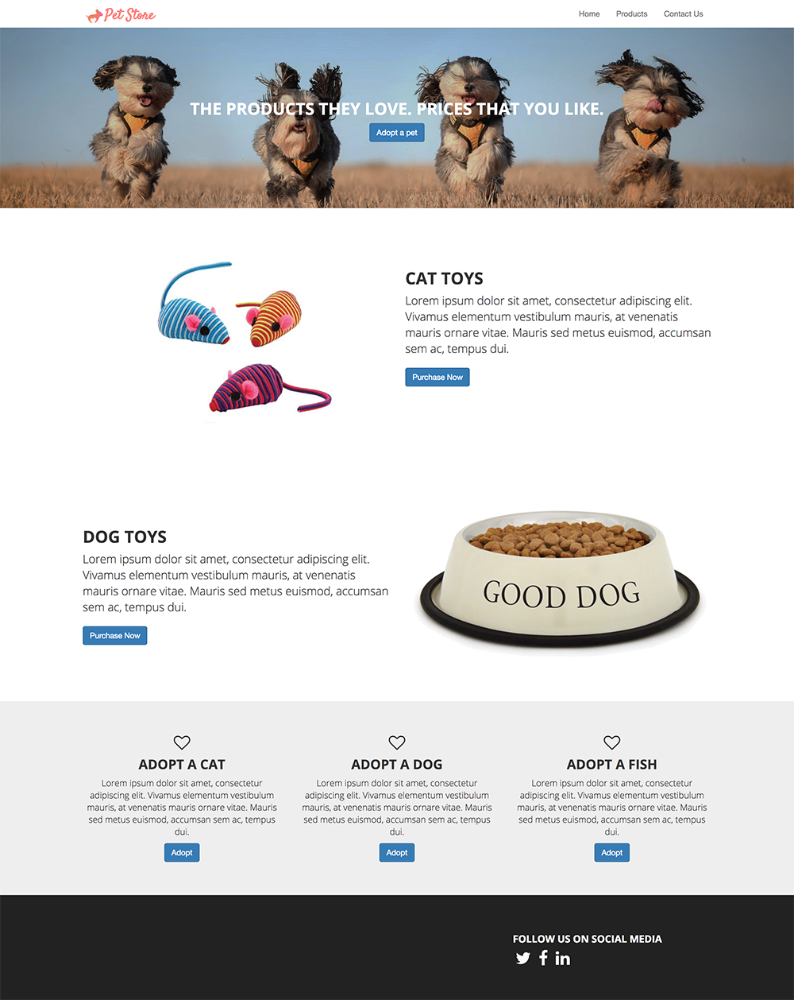
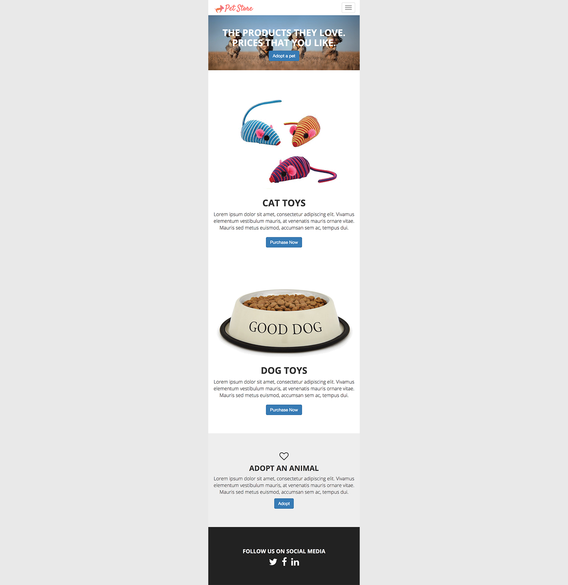

# petstore-2018-boilerplate
Includes all the necessary files needed to get started on this assignment. This exercise helps the student practice getting used to structuring html using the bootstrap framework and styling using built-in bootstrap classes,media query, and a little css. Some default presets styles are added into the styles.css to help lessen css code needed by the student.

Recreate this site using the bootstrap framework.

## This is how it should look on medium and large screens
<figure>
    
</figure>

## This is how it should look on extra-small and small screens
<figure>
    
</figure>
